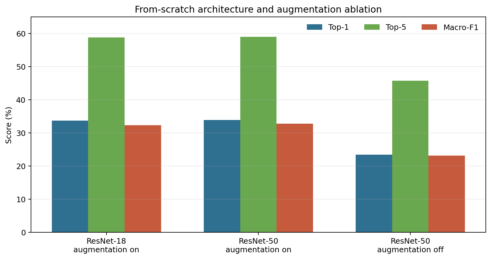

# Fine-Grained Species Classification

A reproducible PyTorch pipeline for classifying visually similar species from
iNaturalist images. The project focuses on controlled CNN experiments: every
run records its configuration, data split, learning curves, checkpoint, test
metrics, confusion matrix, and per-image predictions.

## Highlights

- Deterministic class sampling and leakage-free train/validation/test manifests.
- ResNet-18 and ResNet-50 with either random or ImageNet initialization.
- Controlled architecture and augmentation ablations.
- Top-1, Top-5, balanced accuracy, macro precision, recall, and F1.
- Checkpoint resume, best-model selection, test-time evaluation, and Top-5 inference.
- CPU/GPU portability with no machine-specific paths in the codebase.

## Experimental finding

The strongest from-scratch run used ResNet-50 with augmentation and reached
**33.88% Top-1**, **59.02% Top-5**, and **32.81% macro-F1** on a held-out
500-species benchmark. Removing augmentation reduced Top-1 to **23.38%**, while
switching from ResNet-18 to ResNet-50 changed Top-1 by only **0.22 percentage
points**. The main limitation was overfitting under limited per-species data.

See [docs/RESULTS.md](docs/RESULTS.md) for the controlled comparison and
[docs/INTERVIEW_GUIDE.md](docs/INTERVIEW_GUIDE.md) for concise design notes.



## Repository layout

```text
configs/                    Experiment configurations
docs/                       Architecture, results, and interview notes
src/species_classifier/     Data, model, training, evaluation, and CLI code
tests/                      Fast unit and contract tests
```

Datasets, generated manifests, checkpoints, and result artifacts are excluded
from Git. The repository contains source code only.

## Installation

Create a virtual environment and install a PyTorch build suitable for your
machine. Then install this project:

```bash
python -m venv .venv
# Windows: .venv\Scripts\activate
# macOS/Linux: source .venv/bin/activate
pip install -e ".[dev]"
```

For GPU training, follow the official PyTorch installation selector so the
installed build matches the local CUDA runtime.

## Dataset preparation

Download the official iNaturalist 2021 `train_mini` and `val` images and JSON
annotations. Place or link them under a local data directory:

```text
data/raw/
  train_mini.json
  val.json
  train_mini/...
  val/...
```

The image paths inside the official annotation files are preserved. Generate a
new deterministic subset and split manifests with:

```bash
species-prepare --config configs/resnet50_scratch.yaml
```

This command samples eligible categories using the configured seed, assigns a
contiguous label space, draws training and validation images from
`train_mini`, and reserves official `val` images as the held-out test set.

## Training

```bash
species-train --config configs/resnet50_scratch.yaml
```

Useful overrides:

```bash
species-train --config configs/resnet50_scratch.yaml --epochs 1 --device cpu
species-train --config configs/resnet50_scratch.yaml --resume checkpoints/resnet50_scratch/last.pth
```

The best checkpoint is selected only by validation Top-1. The test set is
evaluated after training and is never used for model selection.

## Evaluation and inference

Evaluate a frozen checkpoint over the complete test manifest:

```bash
species-evaluate \
  --config configs/resnet50_scratch.yaml \
  --checkpoint checkpoints/resnet50_scratch/best.pth
```

Run Top-5 inference on one image:

```bash
species-predict \
  --config configs/resnet50_scratch.yaml \
  --checkpoint checkpoints/resnet50_scratch/best.pth \
  --image path/to/image.jpg
```

## Reproducing the ablations

The included configs change one factor at a time:

| Config | Architecture | Initialization | Augmentation |
|---|---|---|---|
| `resnet18_scratch.yaml` | ResNet-18 | Random | On |
| `resnet50_scratch.yaml` | ResNet-50 | Random | On |
| `resnet50_scratch_noaug.yaml` | ResNet-50 | Random | Off |
| `resnet50_pretrained.yaml` | ResNet-50 | ImageNet | On |

All other data, optimizer, scheduler, image-size, batch-size, and epoch settings
remain matched unless explicitly overridden.

## Design decisions

- **Macro metrics:** Fine-grained errors can be hidden by aggregate accuracy;
  macro precision, recall, and F1 weight every species equally.
- **Reproducible manifests:** Split CSVs record every image and label used by a
  run, but are generated locally rather than distributed with the repository.
- **Validation-only selection:** The test set is touched only by final evaluation.
- **Portable checkpoints:** A checkpoint stores model, optimizer, scheduler,
  epoch, history, class metadata, and resolved configuration.

## Data and attribution

This repository does not distribute iNaturalist images, annotations, derived
manifests, or trained weights. Obtain the dataset from its official source and
follow its terms of use.

The implementation uses PyTorch and torchvision model definitions. Optional
ImageNet initialization is provided through torchvision's official pretrained
weights API. Dataset reference:

> Van Horn et al. Benchmarking Representation Learning for Natural World Image
> Collections. CVPR, 2021.

## License

Source code in this repository is released under the MIT License. Dataset and
third-party library licenses remain with their respective owners.
